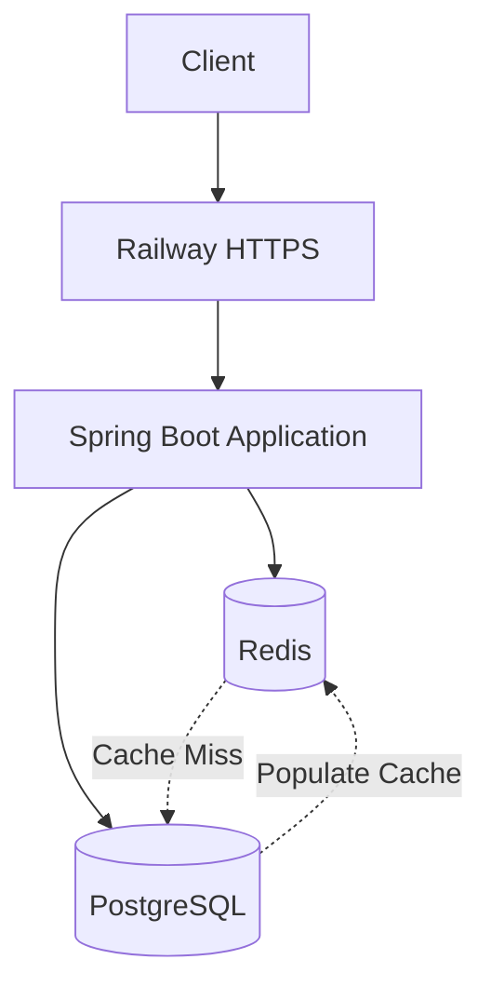

# URL Shortener

A production-oriented URL Shortener built with Java and Spring Boot.

The project implements a clean backend architecture with PostgreSQL as the source of truth, Redis using the Cache-Aside pattern, database migrations with Flyway, automated testing, Docker containerization, GitHub Actions CI, OpenAPI documentation, and public deployment on Railway.

## Live Demo

https://url-sh.up.railway.app

## API Documentation

Interactive Swagger UI:

https://url-sh.up.railway.app/swagger-ui.html

OpenAPI specification:

https://url-sh.up.railway.app/v3/api-docs

## Architecture



The application is designed as a stateless monolith.

PostgreSQL is the source of truth, while Redis is an optional performance optimization. If Redis becomes unavailable, the application falls back to PostgreSQL instead of failing the request.

## Features

- Create shortened URLs
- Random Base62 short-code generation
- Collision handling with bounded retries
- PostgreSQL persistence
- Flyway database migrations
- Redis Cache-Aside caching
- Redis failure fallback to PostgreSQL
- One-hour cache TTL
- URL validation
- Global exception handling
- Consistent JSON error responses
- HTTP 302 redirects
- OpenAPI 3 documentation with Swagger UI
- Repository, service, controller, and integration tests
- Docker multi-stage build
- Docker Compose local environment
- Spring Boot Actuator health endpoint
- GitHub Actions CI
- k6 load testing
- Environment-based configuration
- Public HTTPS deployment on Railway

## Tech Stack

| Technology | Purpose |
|---|---|
| Java 25 | Programming language |
| Spring Boot 4.1.1 | Backend framework |
| Spring Web MVC | REST API |
| Spring Data JPA | Persistence abstraction |
| Hibernate | ORM |
| PostgreSQL 16 | Primary database |
| Flyway | Database migrations |
| Redis 8 | Distributed cache |
| springdoc-openapi 3.1.1 | OpenAPI 3 + Swagger UI |
| Maven | Build and dependency management |
| JUnit 5 | Testing |
| Mockito | Unit testing |
| Docker | Containerization |
| Docker Compose | Local infrastructure |
| GitHub Actions | Continuous integration |
| k6 | Load testing |
| Spring Boot Actuator | Application health |
| Railway | Cloud deployment |

## API

### Create Short URL

```http
POST /api/v1/urls
Content-Type: application/json
```

Request:

```json
{
  "originalUrl": "https://www.google.com"
}
```

Response:

```http
HTTP/2 201 Created
```

```json
{
  "shortCode": "DE5mFqD",
  "shortUrl": "https://url-sh.up.railway.app/DE5mFqD"
}
```

### Redirect

```http
GET /{shortCode}
```

The `shortCode` is a 7-character Base62 value.

Example:

```http
GET /DE5mFqD
```

Response:

```http
HTTP/2 302 Found
Location: https://www.google.com
```

### Error Handling

Unknown short codes return:

```http
HTTP/2 404 Not Found
```

Invalid request payloads return:

```http
HTTP/2 400 Bad Request
```

The API uses a consistent JSON error response model.

## OpenAPI / Swagger

The API is documented using OpenAPI 3 and Swagger UI.

Local development:

```text
http://localhost:8080/swagger-ui.html
http://localhost:8080/v3/api-docs
```

The OpenAPI documentation includes:

- Endpoint descriptions
- Request schemas
- Response schemas
- HTTP response codes
- Error response models
- Request and response examples
- Redirect `Location` header documentation

The redirect route is constrained to the actual 7-character Base62 short-code format so that documentation endpoints such as `/swagger-ui.html` and `/v3/api-docs` are not intercepted by the redirect controller.

## Caching Strategy

The redirect path uses the Cache-Aside pattern.

```text
GET /{shortCode}
       |
       v
    Redis
       |
   +---+---+
   |       |
 HIT     MISS
   |       |
   |       v
   |   PostgreSQL
   |       |
   |       v
   |     Redis
   |       |
   +---+---+
       |
       v
Original URL
       |
       v
HTTP 302
```

### Cache HIT

The application retrieves the original URL directly from Redis.

### Cache MISS

The application:

1. Queries PostgreSQL.
2. Returns `404` if the short code does not exist.
3. Stores the URL in Redis.
4. Returns the original URL.

### Cache Failure

Redis is treated as an optimization rather than a source of truth.

If Redis is unavailable, the application falls back to PostgreSQL.

A Redis failure therefore does not make an existing URL inaccessible.

### TTL

Cached URLs use a one-hour TTL.

## Database Design

The main table is:

```text
urls
--------------------------------
id
short_code
original_url
created_at
```

### Design Decisions

- `id` is the internal PostgreSQL primary key.
- `short_code` is the public identifier.
- `short_code` has a database-level `UNIQUE` constraint.
- `original_url` is stored as `TEXT`.
- `created_at` uses PostgreSQL `TIMESTAMPTZ`.
- PostgreSQL remains the source of truth.

The unique constraint is important because application-level uniqueness checks are not sufficient under concurrent requests.

## Short Code Generation

Short codes are generated using random Base62 characters.

The current configuration uses 7 characters:

```text
0-9
a-z
A-Z
```

The theoretical key space is:

```text
62^7 = 3,521,614,606,208
```

Random generation does not mathematically guarantee uniqueness.

Therefore, uniqueness is ultimately enforced by PostgreSQL:

```text
UNIQUE(short_code)
```

If a collision occurs, the application retries generation with a bounded number of attempts.

This makes the database constraint the final authority for uniqueness.

## Transaction & Persistence Strategy

URL creation uses a dedicated persistence service.

The persistence operation runs in an independent transaction and uses:

```text
saveAndFlush()
```

This allows a database uniqueness violation to be detected immediately during a short-code collision attempt.

The retry strategy is intentionally bounded rather than using an unbounded retry loop.

## Validation

Incoming URLs are validated using Jakarta Bean Validation.

Current constraints include:

- URL must not be blank.
- Maximum URL length: 2048 characters.

## Testing

The project contains multiple testing layers.

### Unit Tests

Service-level business logic is tested using JUnit and Mockito.

Examples include:

- URL creation
- Redirect lookup
- Short-code collision retry
- Maximum retry failure
- Cache hit
- Cache miss
- Cache failure fallback
- Not-found behavior

### Controller Tests

The REST controllers are tested independently for:

- `201 Created`
- `302 Found`
- `400 Bad Request`
- `404 Not Found`
- Response body validation
- `Location` header validation

### Repository Tests

Repository behavior is tested against PostgreSQL, including database-level uniqueness enforcement.

### Integration Tests

Integration tests verify interactions with real PostgreSQL and Redis infrastructure.

### Test Result

The current test suite contains:

```text
23 tests
0 failures
0 errors
0 skipped
```

## Performance Testing

The project includes k6 load-testing scenarios for the redirect/cache path.

Representative local results:

| Scenario | Target | Avg | P95 | P99 |
|---|---:|---:|---:|---:|
| PostgreSQL path | 100 RPS | ~4.09 ms | ~6.50 ms | ~20.14 ms |
| Redis HIT | 100 RPS | ~2.10 ms | ~3.59 ms | ~5.17 ms |
| Redis HIT | 500 RPS | ~0.98 ms | ~1.58 ms | ~3.50 ms |
| Redis HIT | 5000 RPS | ~0.55 ms | ~5.39 ms | ~12.98 ms |

The 5000 RPS test was performed in a local development environment.

These results should not be interpreted as production capacity. Local CPU, memory, Docker overhead, and k6 resource consumption affect the measurements.

The purpose of the load tests is to understand application behavior and identify bottlenecks rather than claim a specific production throughput.

## Configuration

Application configuration is externalized through environment variables.

Important variables include:

```text
SPRING_DATASOURCE_URL
SPRING_DATASOURCE_USERNAME
SPRING_DATASOURCE_PASSWORD

SPRING_DATA_REDIS_HOST
SPRING_DATA_REDIS_PORT
SPRING_DATA_REDIS_USERNAME
SPRING_DATA_REDIS_PASSWORD

APP_BASE_URL
```

Secrets are not committed to the repository.

For local development, the database password is provided through `.env`.

Example:

```env
POSTGRES_PASSWORD=<your-password>
```

The `.env` file is excluded from Git.

## Running Locally

### Prerequisites

- Java 25
- Docker
- Docker Compose
- Git

### Clone

```bash
git clone https://github.com/ahmedsamirdevpro/url-shortener.git
cd url-shortener
```

### Start PostgreSQL and Redis

```bash
docker compose up -d postgres redis
```

Check the services:

```bash
docker compose ps
```

### Configure Database Password

Create `.env`:

```env
POSTGRES_PASSWORD=<your-password>
```

Then export the password:

```bash
set -a
source .env
set +a

export SPRING_DATASOURCE_PASSWORD="$POSTGRES_PASSWORD"
```

### Run Tests

```bash
./mvnw clean test
```

### Run the Application

```bash
./mvnw spring-boot:run
```

The application will be available at:

```text
http://localhost:8080
```

### Run with Docker Compose

Build the application image:

```bash
docker compose build url-shortener
```

Start the application:

```bash
docker compose up -d url-shortener
```

Check the logs:

```bash
docker compose logs --tail=100 url-shortener
```

## Docker

The project uses a multi-stage Docker build.

### Build

```bash
docker build -t url-shortener:latest .
```

The build stage compiles the application using the Maven Wrapper.

The runtime stage uses a smaller JRE image and runs the generated Spring Boot JAR.

## Health Check

Spring Boot Actuator exposes:

```http
GET /actuator/health
```

Example:

```json
{
  "status": "UP"
}
```

## Continuous Integration

GitHub Actions runs the automated test suite on:

- Pushes to `master`
- Pull requests targeting `master`

The CI workflow provisions PostgreSQL and Redis service containers and runs:

```bash
./mvnw -B clean test
```

## Production Deployment

The application is publicly deployed on Railway.

Production architecture:

```text
                    Internet
                       |
                       v
              Railway HTTPS Domain
                       |
                       v
                Spring Boot App
                  /          \
                 /            \
                v              v
             Redis         PostgreSQL
             Cache          Source of Truth
```

The application is deployed from GitHub using the project's Dockerfile.

Production configuration is supplied through environment variables and Railway service references rather than hard-coded credentials.

## Project Structure

```text
url-shortener/
├── .github/
│   └── workflows/
│       └── ci.yml
├── src/
│   ├── main/
│   │   ├── java/com/ahmedsamir/urlshortener/
│   │   │   ├── config/
│   │   │   ├── controller/
│   │   │   ├── dto/
│   │   │   ├── entity/
│   │   │   ├── exception/
│   │   │   ├── repository/
│   │   │   └── service/
│   │   └── resources/
│   │       ├── application.yaml
│   │       └── db/migration/
│   └── test/
│       └── java/com/ahmedsamir/urlshortener/
│           ├── controller/
│           ├── repository/
│           └── service/
├── load-tests/
│   └── redirect-cache-hit.js
├── .dockerignore
├── .gitignore
├── docker-compose.yml
├── Dockerfile
├── mvnw
├── mvnw.cmd
├── pom.xml
└── README.md
```

## Design Decisions

### Monolith First

The application intentionally uses a modular monolith instead of microservices.

This keeps the system simple enough to develop and reason about while still allowing production-oriented concerns such as caching, database migrations, testing, containerization, observability, and CI.

### PostgreSQL as Source of Truth

Redis is not treated as persistent storage.

The database remains authoritative and Redis can be rebuilt or lost without losing URL mappings.

### Cache-Aside

Cache-Aside was selected because redirects are read-heavy and URL mappings are relatively stable.

The application controls when data is read from and written to the cache.

### Database-Enforced Uniqueness

The application generates random short codes, but PostgreSQL guarantees uniqueness.

This avoids relying on a non-atomic:

```text
check → insert
```

sequence as the final correctness mechanism.

### Bounded Retries

Short-code collision retries are bounded to avoid an infinite retry loop.

### Stateless Application

The application does not keep user-specific session state in memory.

This allows the application layer to be horizontally scaled in the future.

## Future Improvements

Potential future versions could introduce:

- URL expiration
- Custom aliases
- Click analytics
- Rate limiting
- Distributed ID generation
- Read replicas
- Horizontal application scaling
- Distributed cache locking for high-contention scenarios
- Kafka or another event-streaming platform for asynchronous analytics
- Custom domain support

These features are intentionally outside the current MVP scope.

## License

This project is intended as a backend engineering portfolio project.
